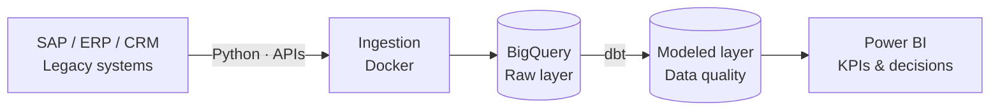

<!-- ===================================================== -->
<!--   RYAN PIEGE · PROFILE README                         -->
<!--   Palette: #0B5FD9 · #0A192F · #38BDF8 · #10B981     -->
<!-- ===================================================== -->

### Software & Data Engineer · Process Automation

**Building scalable data platforms, reliable integrations and automations that remove manual work.**

---

## 👋 About

I build the layer where **software, data and business processes meet**: from backend and APIs to cloud analytics pipelines.

My focus is turning manual routines, legacy systems (ERP/SAP) and raw data into **reliable, documented and scalable** solutions. Outside of work, I study embedded systems, electronics and high-performance computing.

---

## 🧭 What I Do

| 💻 Software & Integration | 📊 Data Engineering | ⚙️ Automation & Cloud |
| :--- | :--- | :--- |
| Backend development | ETL / ELT pipelines | Python automation |
| REST APIs | Apache Spark | Playwright · Selenium |
| CRM & ERP integration | dbt · Data modeling | SAP / ERP automation |
| System architecture | BigQuery · Warehousing | Docker · GCP |

---

## 🛠️ Stack

 

<b>Competency matrix</b>

 

| Domain | Tools & skills |
| :--- | :--- |
| Data Engineering | Spark · dbt · BigQuery · SQL · ETL/ELT · Data Modeling · Data Quality |
| Software & Backend | Python · PHP · JavaScript · REST APIs · MySQL |
| Automation | Selenium · Playwright · OpenPyXL · Power Automate · VBScript |
| Cloud & DevOps | GCP · Docker · Linux · Git |
| Enterprise & BI | SAP ERP · CRM · SharePoint · Power BI (DAX, Power Query) |
| Hardware | Arduino · ESP32 · Raspberry Pi · PCB Design · IoT |

---

## 🧱 How I Think About Pipelines

> Problem → technical challenge → architecture → result. Every project below follows this structure.

---

## 📂 Featured Projects

| Project | What it solves | Stack |
| :--- | :--- | :--- |
| 📊 **Data Engineering Pipeline** | Automated ingestion, transformation and cloud analytics | Python · Spark · BigQuery · dbt |
| ⚡ **ETL Platform** | SAP ERP data extraction and transformation into analytics tables | Python · ETL · BigQuery |
| 🤖 **Process Automation** | Workflows that replace repetitive operational routines | Python · Selenium · Playwright |
| 🐳 **Data Engineering Lab** | Containerized environment to test the modern data stack | Docker · Python · Spark · dbt |
| 🏢 **Enterprise CRM** | Management platform with CRM, ERP, dashboards and REST APIs | PHP · MySQL · REST API |
| 🖥️ **VRX Platform** | Personal hardware platform: embedded systems and HPC | PCB · Embedded · IoT |

> 🔗 Links: adicione o link de cada repositório no nome do projeto.

---

## 🎯 Current Focus

| Software | Data | Infrastructure |
| :--- | :--- | :--- |
| Backend & REST APIs | Apache Spark | Docker |
| System integration | dbt · Data modeling | Google Cloud |
| Software architecture | BigQuery | Cloud architecture · Linux |

---

## 🧠 Engineering Principles

- **Start from the business problem**, not the tool.
- **Design data platforms that scale** and stay observable.
- **Automate the repetitive**, document the rest.
- **Apply software engineering to data**: clean code, versioning, containers.

---

  

**Open to technical exchange and to complex automation and data projects.**

